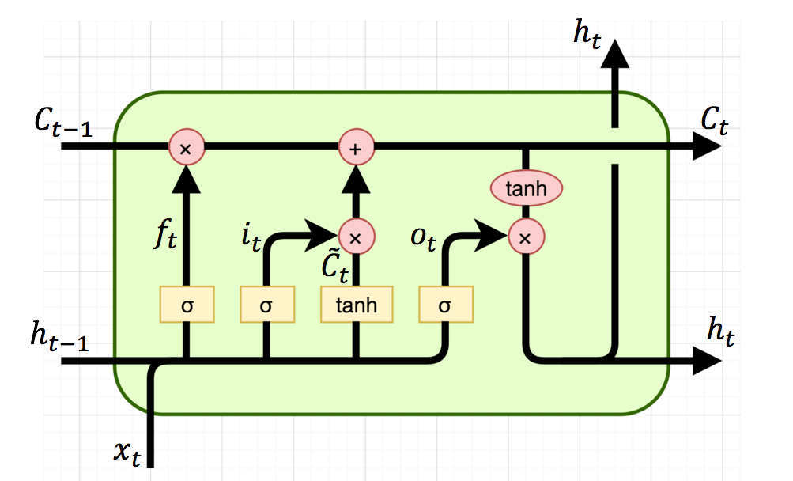

class: inverse
#State of Deep Learning
```{r, load_refs, include=FALSE, cache=FALSE}
library(RefManageR)
BibOptions(check.entries = FALSE,
           bib.style = "alphabetic",
           cite.style = 'authortitle',
           max.names= 1,
           style = "markdown",
           hyperlink = TRUE,
           dashed = FALSE)
myBib <- ReadBib("./bibliography.bib", check = FALSE)
```

## Struggles

.pull-left[


* Generalization

* Training Bias

* Over/Under fitting

* Model Size/Complexity

## Solutions?


* More complex models


* Layer Stacking


* Aggressive Data Dollection


* Adding more humans into "machine"  
learning

]

.pull-right[


.footnote[image src: [xkcd](https://xkcd.com/1838/)]
]

---
class: inverse, middle, center

# Other Options?

???
Is there anything else we can try to make 
deep learning better?  

What else can we 
besides what we've been trying?

---
class: center
# What about actual math?
.pull-left[


]

.pull-right[

]

.footnote[
.left[
left: [www.euclideanspace.com/maths/algebra/multidimensional/vectorSpace.png](https://www.euclideanspace.com/maths/algebra/multidimensional/vectorSpace.png)  
right: `r AutoCite(myBib,"algebra")`
]]

???
Rather than trying to imagine yet another combination of layers and cells,  
lets take a step back and think about what is going on at the most fundamental 
level of these networks.   

Lets look at the math!  

Something interesting sticks out in the two graphics above.  

One subject in particular seem to be related to or fundamental for the fields 
related to mainstream algebra as well as vectors and vector space.
---
background-image:url(./rsc/memes/quaternions.jpg)
class: inverse

.footnote[src: [https://makeameme.org/meme/quaternions]()]

???
QUATERNIONS!

---
# Quaternion | Background
.pull-left[

\begin{equation}
\mathbf{i}^{2}=\mathbf{j}^{2}=\mathbf{k}^{2}=\mathbf{i} \mathbf{j} \mathbf{k}=-1
\end{equation}

\begin{equation}
\begin{aligned} 
Q&=r 1+x \mathbf{i}+y \mathbf{j}+z \mathbf{k}\\
\\
q&=(r, \vec{v}), q \in \mathbf{H}, r \in \mathbf{R}, \vec{v} \in \mathbf{R}^{3}\\
\\
Q_{\operatorname{mat}}&={\left[
\begin{array}{cccc}
{r} & {-x} & {-y} & {-z} \\ 
{x} & {r} & {-z} & {y} \\ 
{y} & {z} & {r} & {-x} \\ 
{z} & {-y} & {x} & {r}
\end{array}\right]}\end{aligned}
\end{equation}


]

.pull-right[
.history[
## History

- Hamilton in 1843
- "vector" and "scalar"
- Gibbs (and vector analysis)
- Resurgence
  - Quantum Mechanics
  - Number Theory
]]

???
Sir William Hamilton
in a flash of genius discovered
the fundamental formula for
quaternion multiplication 
& cut it on a stone of this bridge  

* Hamilton's work in quaternions was a polarizing topic at the time.  
Some went as far as to deam them "mixed evil".  

* Josiah Gibbs, introduced his own vector analysis. Greatly recycling the 
properties of the imaginary vector part, but rather than their components 
multiplying to -1 they equaled 0;


---
# Quaternion | Properties

.pull-left.center[
\begin{equation}
\begin{array}{c|c c c c}
{\times}&{1} & {i} & {j} & {k}\\ 
\hline {1} & {1} & {i} & {j} & {k}\\
{i} & {i} & {-1} & {k} & {-j}\\ 
{j} & {j} & {-k} & {-1} & {i}\\ 
{k} & {k} & {j} & {-i} & {-1}\end{array}
\end{equation}

<br/>

]

.pull-right.history[
### Properties

* Non-commuting
* Anti-commuting
* Double Cover

\begin{equation}
\begin{aligned} 
i j &=-j i=k \\ 
j k &=-k j=i \\ 
k i &=-i k=j \end{aligned}
\end{equation}

.footnote[
.right[
<!--top: [By Maschen - Own work, CC BY-SA 3.0](https://commons.wikimedia.org/w/index.php?curid=27793856-->
img: [By Cayley_graph_Q8.png: Sullivan.t.j.Original uploader was Sullivan.t.j at en.wikipediaderivative CC BY-SA 3.0](https://commons.wikimedia.org/w/index.php?curid=16302914)
]]
]

???
* The "redundancy" Gibbs did away with is in fact the part of quaternions 
that make them appealing today.
* Non commuting means that the order operating is important. This makes them 
very useful for calculating spacial position and roations in 3-D. Try putting you phone down on a surface.  
Flip it over (away from you)  
rotate it 90 degrees.  
Note the potion.  
Now begin in the same start position but this time rotate 90, then flip over its end.  
You should find it face down but oriented the opposite direction.
* This is related to double cover. In 3D space, a quaternion performs 2 full rotations 
to complete 1 full 4d rotation.


---
class: inverse, middle, center
# Quaternion Valued <br/>Neural Networks


---
#Hamilton Product


.center[
\begin{equation}
\begin{aligned}\
Q_{1}\otimes Q_{2} &\neq Q_{2} \otimes Q_{1} \\
Q_{1}\otimes Q_{2} &=\left(r_{1} r_{2}-x_{1} x_{2}-y_{1} y_{2}-z_{1} z_{2}\right) \\ 
&+\left(r_{1} x_{2}+x_{1} r_{2}+y_{1} z_{2}-z_{1} y_{2}\right) i \\ 
&+\left(r_{1} y_{2}-x_{1} z_{2}+y_{1} r_{2}+z_{1} x_{2}\right) j \\ 
&+\left(r_{1} z_{2}+x_{1} y_{2}-y_{1} x_{2}+z_{1} r_{2}\right) k \end{aligned}
\end{equation}
]

.footnote[
`r AutoCite(myBib, "qConv")`
]

???
* The Hamilton product (⊗) is used in QNN to remplace the standard real-valued dot
product, and to perform transforma- tions between two quaternions

* In the case of a quaternion-valued neural network, the quaternion-weight
components are shared through multiple quaternion-input parts during the
Hamilton product , creating relations within the elements.

---
background-image: url(./rsc/real_conv2.png)
background-size: contain
# CNN vs QCNN (Real)


.footnote[
src: `r AutoCite(myBib, "qConv2")`
]

???
in the specific case of image recognition, a good model has to efficiently
encode local relations within the input features, such as between the Red,
Green, and Blue (R,G,B) channels of a single pixel, as well as structural
relations  

Traditional real-valued CNNs consider pixels as three different and separated
values (R, G, B), while a more natural representation is to process a pixel as a
single multi- dimensional entity

---
background-image: url(./rsc/q_conv2.png)
background-size: contain
# CNN vs QCNN (Quaternion)


.footnote[
src: `r AutoCite(myBib, "qConv2")`
]

---
background-image: url(/rsc/diagrams/conv_q.png)
background-size: contain
# CNN vs QCNN (Quaternion)


.footnote[
src: `r AutoCite(myBib, "gaudet_maida_2018")`
]

---
# LSTM vs QLSTM


.pull-left[

\begin{equation}
\begin{aligned}\
&\text{Quaternion-Valued}\\
f_{t}&=\sigma\left(W_{f} \otimes x_{t}+R_{f} \otimes h_{t-1}+b_{f}\right)\\
i_{t}&=\sigma\left(W_{i} \otimes x_{t}+R_{i} \otimes h_{t-1}+b_{i}\right)\\ 
o_{t}&=\sigma\left(W_{o} \otimes x_{t}+R_{o} \otimes h_{t-1}+b_{o}\right)\\  
c_{t}&=f_{t} \times c_{t-1}\\
&{ }+ i_{t} \times \alpha\left(W_{c} \otimes x_{t}+R_{c} \otimes h_{t-1}+b_{c}\right)\\
h_{t}&=o_{t} \times \alpha\left( c_{t} \right)\end{aligned}
\end{equation}
]

.pull-right[
\begin{equation}
\begin{aligned}\
&\text{Real-Valued}\\
f_{t} &=\sigma_{g}\left(W_{f} x_{t}+U_{f} h_{t-1}+b_{f}\right)\\
i_{t} &=\sigma_{g}\left(W_{i} x_{t}+U_{i} h_{t-1}+b_{i}\right) \\
o_{t} &=\sigma_{g}\left(W_{o} x_{t}+U_{o} h_{t-1}+b_{o}\right) \\
c_{t} &=f_{t} \circ c_{t-1}\\
&+i_{t} \circ \sigma_{c}\left(W_{c} x_{t}+U_{c} h_{t-1}+b_{c}\right) \\ 
h_{t} &=o_{t} \circ \sigma_{h}\left(c_{t}\right)\end{aligned}
\end{equation}

]

.center[

]
.footnote[`r AutoCite(myBib, "rathor")`]

???

1. Activation functions in the quaternion domain.
2. Dedicated parameters initialization.
3. Quaternion-valued Backpropagation Through Time (QBPTT)


---
class: inverse, middle, center
# QNN Research<br/>Examples

---
# Parcollet, Morchid, and Linarès et al.

## Recent Papers

* Real to H-Space Encoder for Speech Recognition [https://arxiv.org/pdf/1906.08043.pdf]()
* Quaternion Convolutional Neural Networds for Heterogeneus Image Processing 
[https://arxiv.org/pdf/1811.02656.pdf]()

## Other

* Github Repo [Orkis-Research](https://github.com/Orkis-Research)
* A survey of quaternion neural networks [Artificial Intelligence Review](https://doi.org/10.1007/s10462-019-09752-1)


---
# R2H (Real to Quaternion) Layer


.footnote[
`r AutoCite(myBib, "r2h")`
]

---
# Speech Recognition


.footnote[
`r AutoCite(myBib, "parcollet_morchid_linares_mori_2019")`
]

---
# Speech Recognition Pt. 2

.center[


]

.footnote[
`r AutoCite(myBib, "parcollet_morchid_linares_mori_2019")`
]

---
# Heterogeneous Image Processing

## Oh my generalization!


.footnote[
`r AutoCite(myBib, "qConv")`
]

???
The small number of neurons allows the QCAE to ob- tain “robust” and “compact”
memory that build a robust hid- den representations of the image content in the
latent space. Indeed, QCAE are not altered by heterogeneous color spaces  

They demonstrate that quaternion convolutional encoder-decoders are able to
perfectly learn the color-space with a training performed on a unique gray-scale
image,  

while real-valued CAE fail,  

The Hamilton product allows QNN to encode local dependencies such as the RGB 
relation of a pixel.  

QCAE produced better quality reconstructions with respect to the PSNR and SSIM metrics
than CAE, even with considering the unability of CAE to learn colors

---
class: inverse, middle, center
# Going Forward...

```{r child = '_000.Rmd'}
```