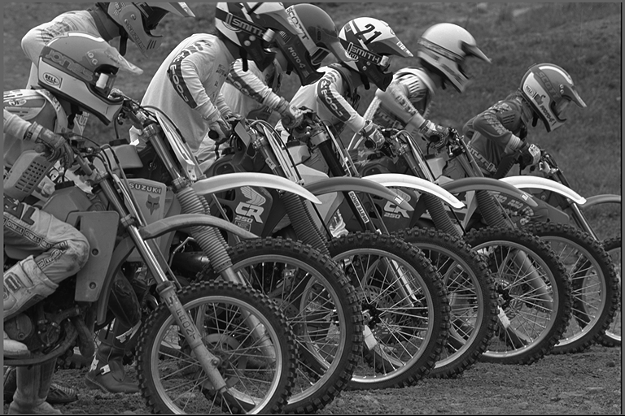
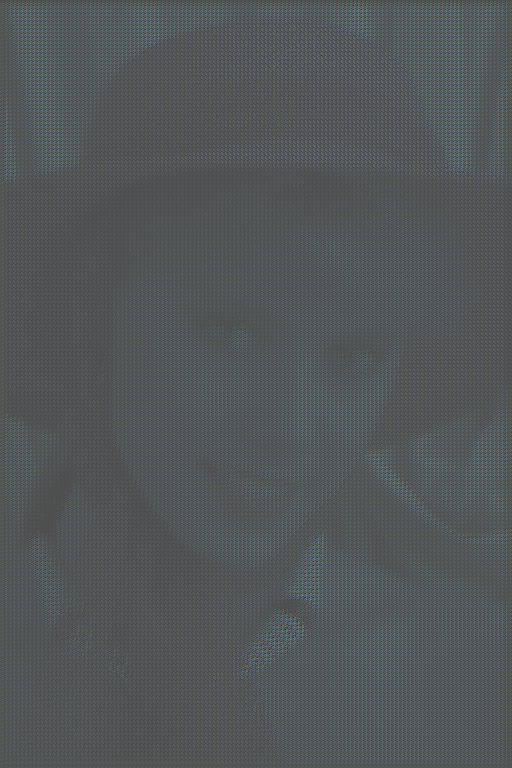
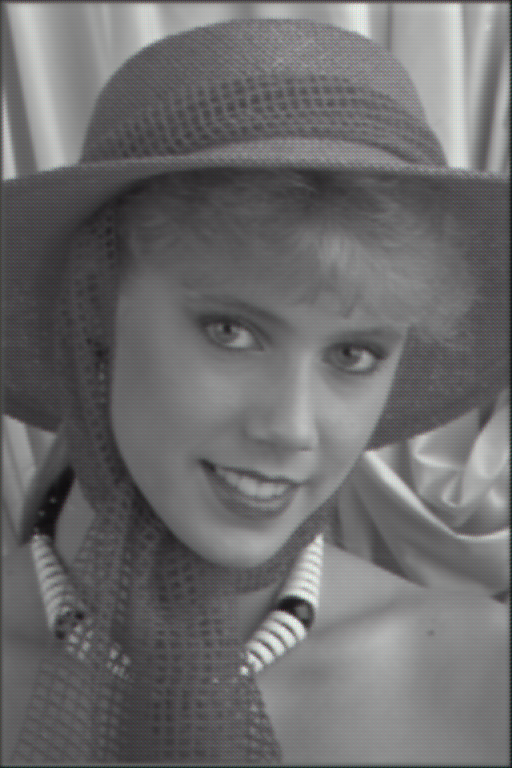
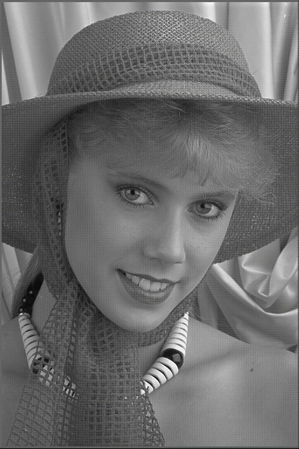
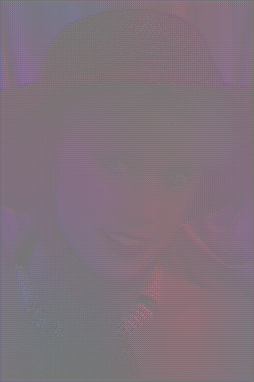
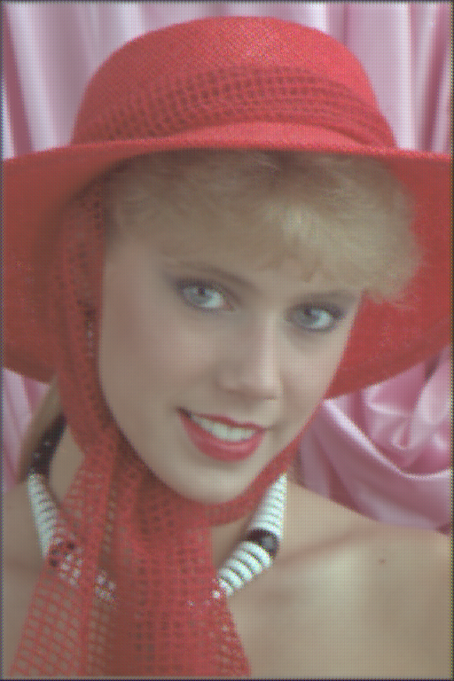
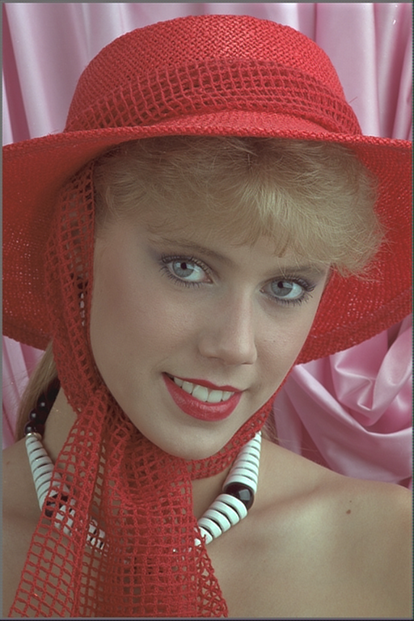
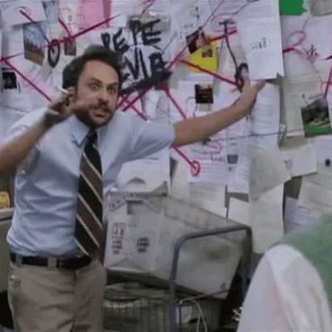

background-image: url("rsc/memes/confused.jpg")
background-size: contain
class: center, bottom, inverse

???

Image Credit : https://news.sky.com/story/blinking-white-guy-meet-the-man-using-meme-fame-to-raise-thousands-for-charity-11819235

---
class: inverse, middle, center

# What??

???
* Explain what Quaternions are and how they relate to complex hyper complex

* Imaginary

---

#Why

---

# Training Data

---

# Conv Auto Encoder

---
# Quaternion Conv Auto Encoder

--

###...ok but why? 
### Lets look into the math going on here.Its got to be obvious. 

---
## What we know: 
* Architecture of the Quaternion networks are not unfamiliar
  * Q flavored LSTM, CNN, AutoEncoder etc.
  * Trade out Real Number math for Hamilton $\mathbb{R} \rightarrow \mathbb{H}$

---
class: inverse, center

#[BEGIN: Descent to Madness]

---

